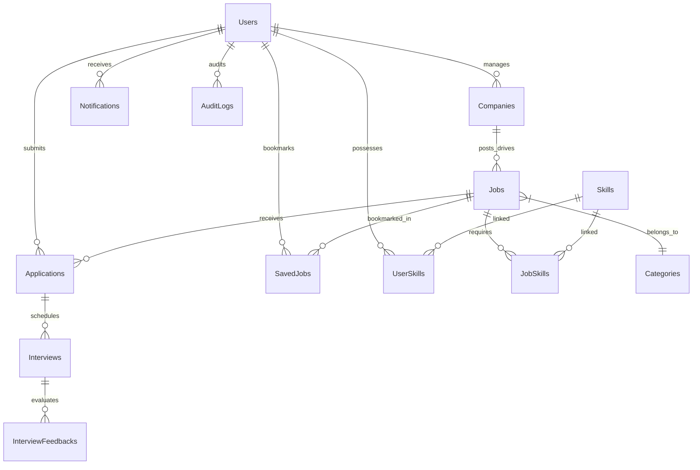

# 🎓 SkillSync: Enterprise Campus Placement & Internship Management System

A production-grade **University Campus Placement & Internship Management Engine** built with **Node.js, Express.js, Sequelize ORM, MySQL 8.0, and React**.

Designed as a high-impact engineering portfolio project featuring **13 Normalized Relational MySQL Tables**, **Automated Campus Eligibility Engine**, **Weighted Skill Recommendation Algorithm**, **Raw SQL Analytics (Window Functions & CTEs)**, **Swagger OpenAPI Docs**, and **Sequelize Managed Transactions**.

---

## 🛠️ System Architecture & Database ER Diagram



---

## 🌟 Key Engineering Features

### 1. 🎓 Campus Eligibility Engine
Automated eligibility checker validating:
- **Minimum CGPA Threshold**
- **Graduation Batch & Stream / Branch Compatibility**
- **Maximum Active Backlogs Count**
- **Required Primary Tech Skills**
Provides real-time checklist breakdown with pass/fail reasons (e.g. `❌ Required CGPA: 8.0 (Your CGPA: 7.4)`).

### 2. ⚡ Multi-Factor Weighted Skill Recommendation Scoring
Matches candidate profiles against active placement drives using weighted formula:
$$\text{Score} = (50\% \times \text{Primary Skills}) + (20\% \times \text{Skill Proficiency}) + (15\% \times \text{CGPA}) + (10\% \times \text{Location}) + (5\% \times \text{Drive Type})$$
Returns granular skill match breakdown: `React: 90%`, `Node.js: 100%`, `MySQL: 100%`, `Docker: 0%`.

### 3. 📊 Raw SQL Analytics (Window Functions & CTEs)
- **TPO Admin Dashboard**: Total Placed Students, Average Package (LPA), Highest Package (LPA), Placement Conversion Funnel, Top Demanded Skills.
- **MySQL Window Functions**: `ROW_NUMBER() OVER(PARTITION BY companyId ORDER BY salary DESC)` to compute top package rankings per company.
- **Common Table Expressions (CTEs)**: `WITH DailyStats AS (...)` to track application trends over time.

### 4. 🔒 Concurrency-Safe DB Transactions & Security
- **Atomic Transactions**: Application submission wraps operations in `sequelize.transaction()` to prevent partial DB writes and race conditions.
- **Duplicate Prevention**: Composite unique indexes `(jobId, applicantId)`.
- **API Security**: `helmet` security headers, CORS protection, `express-rate-limit`, structured `winston` logging.
- **Swagger Documentation**: Interactive Swagger UI available live at `/api-docs`.

---

## 📄 ATS Resume Bullet Points (Copy & Paste for Resume)

> **University Campus Placement & Internship Management System (Full-Stack Engineer)**
> - Designed and implemented a 13-table normalized MySQL database using Sequelize ORM, incorporating composite indexes `(companyId, status)` and foreign key constraints for optimal query performance.
> - Developed an automated **Campus Eligibility & Skill Recommendation Engine** calculating multi-factor candidate match scores based on CGPA, branch, backlogs, and skill proficiency.
> - Executed raw SQL aggregations using MySQL **Window Functions** (`ROW_NUMBER()`) and **Common Table Expressions (CTEs)** to deliver real-time TPO placement metrics and conversion funnels.
> - Engineered atomic application workflows utilizing **Sequelize Managed Transactions** (`sequelize.transaction()`) to guarantee concurrency safety and zero duplicate applications.
> - Built interactive **Swagger / OpenAPI 3.0** documentation and structured **Winston** request logging for production readiness.

---

## 🚀 Quick Start Guide

### Prerequisites
- **Node.js**: v18 or higher
- **MySQL 8.0**: Installed and running on port 3306

### Installation

1. **Clone the Repository**
   ```bash
   cd C:\Shivangi\CampusPlacementPortal
   ```

2. **Configure Environment Variables**
   Ensure `backend/.env` contains your MySQL credentials:
   ```env
   PORT=8000
   DB_HOST=127.0.0.1
   DB_PORT=3306
   DB_USER=root
   DB_PASSWORD=your_mysql_password
   DB_NAME=placement_portal
   DB_DIALECT=mysql
   JWT_SECRET=supersecretjwtkey123
   ```

3. **Seed Database**
   Automatically creates database `placement_portal`, syncs 13 tables, and seeds sample data:
   ```bash
   node backend/seed.js
   ```

4. **Start Application**
   ```bash
   # Start Backend
   npm run dev

   # Start Frontend (in separate terminal)
   cd frontend
   npm run dev
   ```

5. **Access Points**
   - **Web Application**: `http://localhost:5173`
   - **Swagger API Docs**: `http://localhost:8000/api-docs`

---

## 🔐 Default Demo Accounts

| Role | Email | Password | Capabilities |
| :--- | :--- | :--- | :--- |
| **Student** | `student@demo.com` | `password123` | View eligibility, skill match scores, apply to drives, track applications |
| **Recruiter** | `recruiter@demo.com` | `password123` | Post placement drives, review applicants, schedule interviews |
| **TPO Admin** | `tpo@demo.com` | `password123` | Access TPO Placement Analytics, SQL ranking reports, company management |
