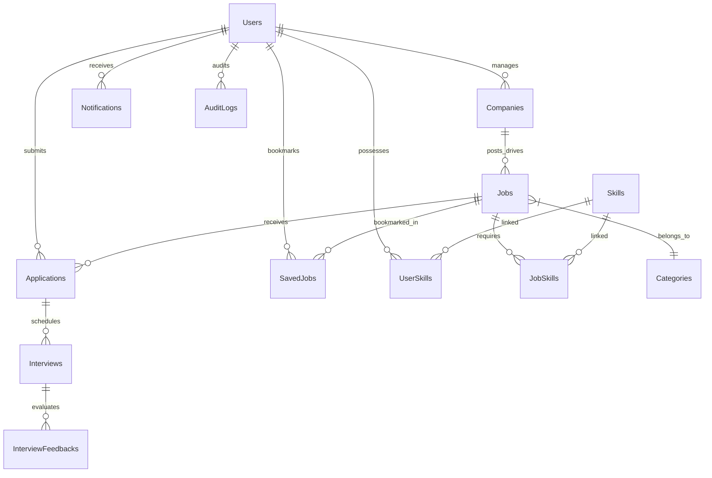

# 🎓 SkillSync — Campus Placement & Internship Management Portal

> A full-stack, production-deployed campus recruitment platform built for NIT Bhopal.

[](https://campus-placement-portal-orcin.vercel.app)
[](https://campus-placement-portal-f3ot.onrender.com)
[](https://github.com/shivangi-guptaa/Campus-Placement-Portal)

---

## 🌐 Live Demo

| Service | URL |
|---------|-----|
| 🖥️ Frontend | [campus-placement-portal-orcin.vercel.app](https://campus-placement-portal-orcin.vercel.app) |
| ⚙️ Backend API | [campus-placement-portal-f3ot.onrender.com](https://campus-placement-portal-f3ot.onrender.com) |

> **Note:** Backend is hosted on Render free tier — first request may take 30–60 seconds to wake up.

---

## 🔐 Demo Accounts

| Role | Email | Password | Access |
|------|-------|----------|--------|
| 🎓 **Student** | `student@demo.com` | `Password@123` | Apply to drives, track status, view eligibility |
| 🏢 **Recruiter** | `recruiter@demo.com` | `Password@123` | Post drives, review applicants, schedule interviews |
| 🛡️ **TPO Admin** | `tpo@demo.com` | `Password@123` | Analytics dashboard, company management, placement reports |

---

## ✨ Features

### 👨‍🎓 Students
- Register with email OTP verification
- Apply to placement drives with eligibility check (CGPA, branch, batch, backlogs)
- Track application status in real-time (Pending → Shortlisted → Interview → Offered)
- View skill-match recommendation scores per drive
- Upload PDF resume, manage profile

### 🏢 Recruiters
- Post placement drives with custom eligibility criteria
- View applicants with CGPA, branch, eligibility badge & resume PDF link
- Update applicant status (Shortlisted / Interview Scheduled / Offered / Rejected)

### 🛡️ TPO Admins
- Placement analytics dashboard with SQL window functions & CTEs
- Company management (add description, website, location, logo)
- Placement calendar with drive timeline modal
- Manage all drives & companies

### 🔒 Security & Auth
- JWT-based authentication (access + refresh tokens)
- Email OTP verification on registration & password reset
- bcrypt password hashing
- Helmet security headers, CORS protection

---

## 🛠️ Tech Stack

| Layer | Technology |
|-------|-----------|
| **Frontend** | React 18, Vite, TailwindCSS, shadcn/ui, Redux Toolkit |
| **Backend** | Node.js, Express.js |
| **ORM** | Sequelize (MySQL / SQLite fallback) |
| **Database** | MySQL 8.0 (local) / SQLite (Render fallback) |
| **Auth** | JWT, bcryptjs |
| **Email** | Nodemailer (Gmail SMTP) |
| **File Upload** | Multer, Cloudinary |
| **Deployment** | Vercel (frontend) + Render (backend) |

---

## 🗄️ Database ER Diagram



---

## 🚀 Local Setup

### Prerequisites
- Node.js v18+
- MySQL 8.0 (optional — SQLite is used automatically if MySQL is not configured)

### Steps

```bash
# 1. Clone the repository
git clone https://github.com/shivangi-guptaa/Campus-Placement-Portal.git
cd Campus-Placement-Portal

# 2. Install all dependencies
npm install
cd frontend && npm install && cd ..

# 3. Create .env file in root
cp .env.example .env
# Fill in your values (see below)

# 4. Seed the database with sample data
npm run seed

# 5. Start backend (port 8000)
npm run dev

# 6. Start frontend in a new terminal (port 5173)
cd frontend && npm run dev
```

### Environment Variables (`.env`)

```env
PORT=8000

# MySQL (optional — SQLite used automatically if not set)
DB_HOST=127.0.0.1
DB_PORT=3306
DB_USER=root
DB_PASSWORD=your_mysql_password
DB_NAME=placement_portal

# Auth
JWT_SECRET=your_super_secret_jwt_key

# Email OTP (optional — OTP skipped if not set)
EMAIL_USER=your_gmail@gmail.com
EMAIL_PASS=your_16_digit_gmail_app_password

# Cloudinary (optional — local storage used if not set)
CLOUDINARY_CLOUD_NAME=your_cloud_name
CLOUDINARY_API_KEY=your_api_key
CLOUDINARY_API_SECRET=your_api_secret
```

---

## ☁️ Production Deployment

### Frontend → Vercel
1. Go to [vercel.com/new](https://vercel.com/new) → Import `shivangi-guptaa/Campus-Placement-Portal`
2. Set **Root Directory**: `frontend`
3. Set **Build Command**: `npm run build`
4. Set **Output Directory**: `dist`
5. Deploy ✅

### Backend → Render
1. Go to [dashboard.render.com](https://dashboard.render.com) → New Web Service
2. Connect `shivangi-guptaa/Campus-Placement-Portal`
3. **Build Command**: `npm install`
4. **Start Command**: `node backend/index.js`
5. Add Environment Variables:

| Key | Value |
|-----|-------|
| `PORT` | `8000` |
| `JWT_SECRET` | *(any random string)* |
| `EMAIL_USER` | *(your Gmail)* |
| `EMAIL_PASS` | *(16-digit Gmail App Password)* |
| `DB_HOST` | *(Railway/PlanetScale MySQL host — optional)* |
| `DB_USER` | *(MySQL user — optional)* |
| `DB_PASSWORD` | *(MySQL password — optional)* |

> 💡 If MySQL env vars are **not set**, the backend automatically uses **SQLite** — no extra setup needed!

---

## 👩‍💻 Developer

**Shivangi Gupta** — NIT Bhopal

[](https://www.linkedin.com/in/shivangi-gupta-nitbhopal)
[](https://github.com/shivangi-guptaa)
