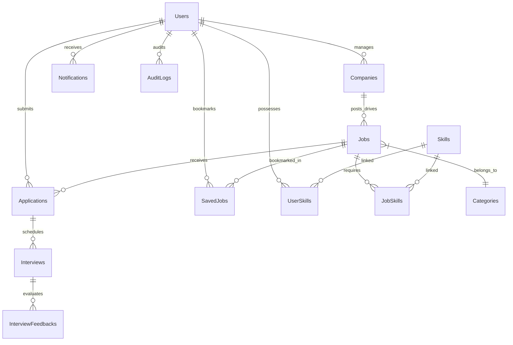

# 🎓 SkillSync: Campus Placement & Internship Management System

A full-stack campus placement and internship management application built using **Node.js, Express.js, Sequelize ORM, MySQL 8.0, and React**.

Built with **13 normalized relational tables**, **automated eligibility evaluation**, **skill match recommendation algorithm**, **raw SQL analytics**, **Swagger API documentation**, and **concurrency-safe database transactions**.

---

## 🛠️ System Architecture & Database ER Diagram



---

## 🌟 Architecture & Features

### 1. 🎓 Campus Eligibility Engine
- Validates student **CGPA**, **Graduation Batch**, **Branch**, **Active Backlogs**, and **Primary Skills**.
- Generates real-time pass/fail checklist evaluation on drive details page.

### 2. ⚡ Skill Match Recommendation Engine
- Calculates candidate match scores based on primary skills, skill proficiency levels, CGPA eligibility, and location.
- Provides skill-by-skill match breakdown (`React: 90%`, `Node.js: 100%`, `MySQL: 100%`).

### 3. 📊 Raw SQL Analytics
- **MySQL Window Functions**: `ROW_NUMBER() OVER(PARTITION BY companyId ORDER BY salary DESC)` to rank top package offers per company.
- **Common Table Expressions (CTEs)**: `WITH DailyStats AS (...)` to analyze daily application velocity.
- **TPO Admin Dashboard**: Placement conversion funnel, placed student metrics, and top requested skills.

### 4. 🔒 Concurrency-Safe Database Transactions & Security
- Applications use `sequelize.transaction()` to guarantee atomic state updates.
- Composite unique indexes `(jobId, applicantId)` prevent duplicate drive applications.
- Integrated `helmet` security headers, `express-rate-limit`, structured `winston` logging, and interactive `Swagger / OpenAPI 3.0` documentation.

---

## 🌐 Live Production Deployment Guide

### Step 1: Deploy Frontend on Vercel
1. Go to [Vercel Dashboard](https://vercel.com/new) and click **Import Project**.
2. Select repository `shivangi-guptaa/Campus-Placement-Portal`.
3. Set **Root Directory**: `frontend`
4. Set **Build Command**: `npm run build`
5. Set **Output Directory**: `dist`
6. Click **Deploy**. Vercel will automatically build and assign a live URL (e.g. `https://campus-placement-portal.vercel.app`).

---

### Step 2: Deploy Backend on Render
1. Go to [Render Dashboard](https://dashboard.render.com/) and click **New Web Service**.
2. Connect your GitHub repository `shivangi-guptaa/Campus-Placement-Portal`.
3. Set **Root Directory**: `.` (or leave blank)
4. Set **Build Command**: `npm install`
5. Set **Start Command**: `node backend/index.js`
6. Add Environment Variables:
   - `PORT`: `8000`
   - `DB_HOST`: `<Your-MySQL-Host>`
   - `DB_USER`: `<Your-MySQL-User>`
   - `DB_PASSWORD`: `<Your-MySQL-Password>`
   - `DB_NAME`: `placement_portal`
   - `JWT_SECRET`: `<Your-JWT-Secret>`
7. Click **Create Web Service**.

---

## 🚀 Local Quick Start Guide

### Prerequisites
- **Node.js**: v18 or higher
- **MySQL 8.0**: Installed and running on port 3306 (or via Docker)

### Option A: Local Run

1. **Clone the Repository**
   ```bash
   git clone https://github.com/shivangi-guptaa/Campus-Placement-Portal.git
   cd Campus-Placement-Portal
   ```

2. **Install Dependencies**
   ```bash
   # Install Backend Dependencies
   npm install

   # Install Frontend Dependencies
   cd frontend
   npm install
   cd ..
   ```

3. **Configure Environment Variables**
   Create a `.env` file in the root directory:
   ```env
   PORT=8000
   DB_HOST=127.0.0.1
   DB_PORT=3306
   DB_USER=root
   DB_PASSWORD=your_mysql_password
   DB_NAME=placement_portal
   DB_DIALECT=mysql
   JWT_SECRET=supersecretjwtkey123
   ```

4. **Seed Database**
   Creates the `placement_portal` database, syncs 13 tables, and seeds sample data:
   ```bash
   npm run seed
   ```

5. **Start Application**
   ```bash
   # Start Backend (Port 8000)
   npm run dev

   # Start Frontend in separate terminal (Port 5173)
   cd frontend
   npm run dev
   ```

### Option B: Run via Docker Compose

```bash
docker-compose up --build
```

---

## 🔐 Default Demo Accounts

| Role | Email | Password | Capabilities |
| :--- | :--- | :--- | :--- |
| **Student** | `student@demo.com` | `password123` | View eligibility, skill match scores, apply to drives, track applications |
| **Recruiter** | `recruiter@demo.com` | `password123` | Post placement drives, review applicants, schedule interviews |
| **TPO Admin** | `tpo@demo.com` | `password123` | Access TPO Placement Analytics, SQL ranking reports, company management |
